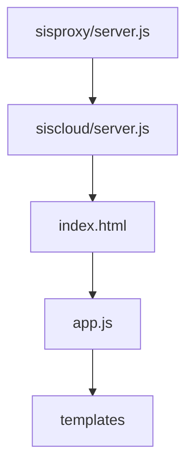

# Current Architecture Understanding

## Role of Sisproxy
Sisproxy uses a set of configuration objects to set up service directories (sisbot/siscloud) to start services. The sisproxy repository also checks the current table state and is able to run a series of git commands to re-orient each repository if they are judged to be out of sync. 

It's theorized that if a new audio service were created, the listening process could be spawned from this project (similar to sisbot and siscloud). Proposed names include sisaudio and sislisten. 

The Sisproxy codebase is not in the most maintainable shape. The team has thoughts of cleaning the space up if they chose to implement new functionality stemming from here.


## Role of Siscloud

Siscloud is, very simply, a boring old web app. It presents itself on port 3001 of the raspberry pi in both development and `sisbot` environments. For porting to mobile, a cordova project is used, but at least right now we don't need to worry too much about this.

Flow of siscloud
sisbot -> siscloud/server.js - which returns index.html to the user.
index.html includes a variety of scripts that start executing--`cordovajs.`, `js/app.js`, `prod/libs.js`, `prod.gen.js`, `prod/models.js` and `prod/templates.js`.

Visually, 

Siscloud loads on clientside primarily through `js/app.js`. This file is responsible for setting up everything on the interface, primarily through templates. Templates are stored in the repo under the 'tmp/' folder, but are processed into files placed under /prod by the `regenerateIndexPage()` method in `siscloud/server.js`.
````
	// TODO: make list of all templates (for preloading)
	var files  = fs.readdirSync(config.dir + '/tmp', 'utf-8');
	var templates = [];
	_.each(files, function(filename) {
		templates.push(filename.replace(/.html$/i, ''));
	});
	// console.log("Templates:", JSON.stringify(templates));
	fs.writeFileSync(config.dir + '/prod/templates.js', 'app.tmps='+JSON.stringify(templates)+';');

	var index_tmp	= _.template(index_page);
	var new_index   = index_tmp({
	    base_url			: config.dir,
	    all_scripts_link	: ''
	});
````


Siscloud's main job is to provide an interface for controlling the table. 


## Role of Sisbot
Sisbot is responsible for serving as one end of the websocket communication. Responsible for communicating with the table's rolling ball (over serial) and the python lights module (via inter-process socket).

While the `sisbot.js` file is gigantic in size and has too much responsibility, this is an area that might prove suitable to inject a module for audio listening, if a final design dictates having a microphone on the pi. Alternatively, this might just serve as an example of how we could set up a socket to communicate with the audio recorder.

If I were Sisyphus industries, I would STRONGLY recommend having broken this section down into smaller bits of functionality -- a module for communicating with the table over serial, a module for talking to the lights, etc. Such division would've made the existing implementation significantly more extensible.


# Integration of New Features
We anticipate the following modules, or areas of functionality:

[Sisyphus App]
* Settings to switch on
* Settings to adjust colors per axis

[Input Stream]

* Takes in audio
* Possibly parses

[Setup for External Module]

* Start up scripts
* Configure ALSA, etc.
* Install python, load modules, etc.

[Algorithm]

* What are the features
* Agnostic to colors
* Take input stream
* Output vector

[Mapping Module]

* Takes in output vector
* Translates to color
* Receives changes from app

[Communication Layer]

* Take color from mapping
* Send to table (latency important)