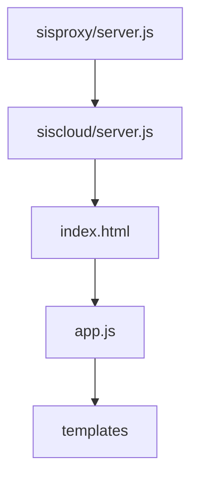

# Current Architecture Understanding

## Role of Sisproxy
Sisproxy uses a set of configuration objects to set up service directories (sisbot/siscloud) to start services. The sisproxy repository also checks the current table state and is able to run a series of git commands to re-orient each repository if they are judged to be out of sync. 

It's theorized that if a new audio service were created, the listening process could be spawned from this project (similar to sisbot and siscloud). Proposed names include sisaudio and sislisten. 

The Sisproxy codebase is not in the most maintainable shape. The team has thoughts of cleaning the space up if they chose to implement new functionality stemming from here.


## Role of Siscloud

Siscloud is, very simply, a vanilla web app. It presents itself on port 3001 of the raspberry pi in both development and `sisbot` environments. For porting to mobile, a cordova project is used, but at least right now we don't need to worry too much about this.

### Flow of siscloud
sisproxy -> siscloud/server.js - which returns index.html to the user.

index.html includes a variety of scripts that start executing--`cordova.js`, `js/app.js`, `prod/libs.js`, `prod.gen.js`, `prod/models.js`, `js/app.config.js` and `prod/templates.js`.

Visually, 

Siscloud loads on clientside primarily through `js/app.js`. This file is responsible for setting up everything on the interface, primarily through templates. Templates are stored in the repo under the 'tmp/' folder, but are processed into files placed under /prod by the `regenerateIndexPage()` method in `siscloud/server.js`.
````
	// TODO: make list of all templates (for preloading)
	var files  = fs.readdirSync(config.dir + '/tmp', 'utf-8');
	var templates = [];
	_.each(files, function(filename) {
		templates.push(filename.replace(/.html$/i, ''));
	});
	// console.log("Templates:", JSON.stringify(templates));
	fs.writeFileSync(config.dir + '/prod/templates.js', 'app.tmps='+JSON.stringify(templates)+';');

	var index_tmp	= _.template(index_page);
	var new_index   = index_tmp({
	    base_url			: config.dir,
	    all_scripts_link	: ''
	});
````


Siscloud's main job is to provide an interface for controlling the table. 


## Role of Sisbot
Sisbot is responsible for serving as one end of the websocket communication. Responsible for communicating with the table's rolling ball (over serial) and the python lights module (via inter-process socket).

While the `sisbot.js` file is gigantic in size and has too much responsibility, this is an area that might prove suitable to inject a module for audio listening, if a final design dictates having a microphone on the pi. Alternatively, this might just serve as an example of how we could set up a socket to communicate with the audio recorder.

It is noteworthy that the `sisbot.js` file is quite large, at 30K+ lines. For this reason, making edits to the file introduces significant risk without regression tests. 

# Integration of New Features
We anticipate the following modules, or areas of functionality:

[Sisyphus App]
* Settings to switch on
* Settings to adjust colors per axis

[Input Stream]

* Takes in audio
* Possibly parses

[Setup for External Module]

* Start up scripts
* Configure ALSA, etc.
* Install python, load modules, etc.

[Algorithm]

* What are the features
* Agnostic to colors
* Take input stream
* Output vector

[Mapping Module]

* Takes in output vector
* Translates to color
* Receives changes from app

[Communication Layer]

* Take color from mapping
* Send to table (latency important)

# Pros and Cons of Different Approaches

### Proposal to Use A Non-Machine Learning / Heavy Audio Processing Algorithm
Pros: 
* Using a model that does not utilize heavy audio processing to generate a color would greatly reduce performance requirements.
* Reduced performance requirements would greatly increase the platform options for deploying and running our algorithm.
* Using a minimalist approach for feature extraction would greatly reduce the number of external libraries required

Cons: 
* Using a model that does not require complex audio features would produce very accurate results
* The decision tree for determining the emotion - which would be based on the valence and arousal that would be calculated from the audio features - would require tuning, likely via regression training of the K-Nearest Neighbor algorithm (discussion on whether KNN counts as an ML approach, and thus out of the scope of this spike is not addressed here), which may take a long time
* There isn't a clear advantage to compensate the risks of taking on this approach

References: #43

### Writing Homegrown Own Machine Learning Algorithm 
Pros:
* Writing team-made machine learning algorithm would give team control of inputs and outputs and the team would be able to create models for different audio sampling rates.
* Writing team-made machine learning algorithm would expose all members to the algorithm creation process, and greatly expand team member knowledge.

Cons:
* Feature correlation to mood in readily-available features is low.
* Datasets available for creating an algorithm of this type are few in number and low in quality. The team would need to build their own dataset. The process of building a specific dataset to train an in-house model is intensive and while possible, most likely exceeds existing time constraints.

References: #43

### Proposal to Use Off-the-Shelf Audio Processing / Machine Learning Algorithm
Pros:
* Algorithm can accept raw audio stream without needing to do expensive file I/O
* Algorithm makes use of 30 features to predict a mood
* Algorithm has MIT licensing making it free to use and legal to alter if need be.
* Algorithm author seems invested in making it usable, was quick to post an update to the model after technical issues by the team were encountered.
* Algorithm dataset acquisition method was provided by the original author if needed.

Cons:
* Depending on a single author for a longterm algorithm is high-risk.


### Proposal to Move Machine Learning to Mobile
See [this wiki page](https://gitlab.com/msoe.edu/sdl/sd21/sisyphus/msoe-sisbot/-/wikis/Knowledge-Acquisitions/Mobile-as-a-Artificial-Intelligence-Computation-Platform). Determined to be infeasible with remaining timetable.

Reference: #48

### Proposal to Run Machine Learning on Existing Raspberry pi
Pros: 
* Same platform, no additional hardware required :)
* The operating system run by the Raspberry pi (Raspbian, essentially ARM-optimized Debian) would run Python code with no issue.
* No additional hardware means seamsless rollout to customers - just a software update!

Cons: 
* Performance implications indicate this solution is not compatible with the pi's current hardware -- the latency is prohibitive and CPU usage would be far too high with the sisbot-server repos running alongside the lighting algorithm.
* Running the CPU high due to performance implications would ruin the pi over time, could potentially start a fire, etc.

Reference: #40

### Proposal to Move Audio Processing / Machine Learning to Microservice
Pros:
* Client device would not matter.
* Server can be written in any language, so running the machine learning and audio processing in their existing library (Python) is not a problem.
* Service cloud architecture would be scalable, so performance of processing time could be elastically expanded if necessary.
* Service architecture is easily expandable by adding a new endpoint (e.g., beat detection).  

Cons:
* Performance with streaming audio may be an issue.
* The binary composition of all audio streams is not identical. This may impact results obtained from using the existing algorithm.

Reference: #49

# Proposal for New Functionality: High Level


In a team meeting on 2020-02-08 at 19:00 hours the team discussed system architecture and created the above diagram as a conceptual model of functionality, showcasing the "service architecture" approach of the audio processing algorithm. The following consensuses were achieved:

* The service shall accept raw audio data (short term)
* The service shall return a _color_, not a _mood_ (short term)
* The service shall be client-agnostic
* The service shall run both PyAudioAnalysis to extract relevant features and the machine learning algorithm to utilize them.

Additionally, the following points were considered:
* Service deployment & extensibility
  * For our purposes, a Heroku service can be used. Is this feasible long-term? Probably not.
* An NVIDIA Jettison device running on the Sisyphus table would easily handle the audio processing and could host a web server. Is this a viable future option for customer rollout?
