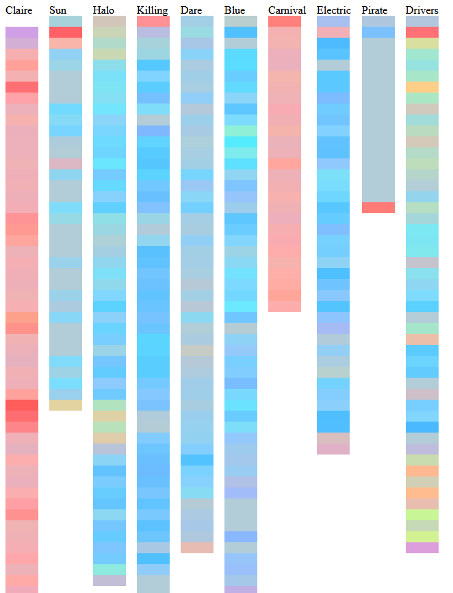
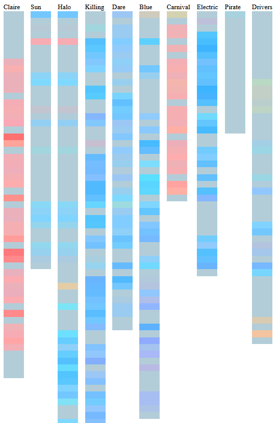

# Overview
In order to facilitate a better user experience the team implemented 2 color smoothing abilities to the `sisbot` endpoint and `mood-lighting-server` respectively.

# `sisbot` Smoothing
* Implemented by @casperjm
* The smoothing function in this part of the code base will transition colors over a period of 127 steps whenever the primary LED color is changed. This gives the effect of interpolating colors and makes changes less jarring (especially when continually generated by the AI service).

## Future Considerations
* Eventually this may become a setting that can be enabled or disabled but the team decided 
* Currently, regardless of pattern, the entire light strip will light up on change - this may be adjusted in the future but the team feels that the current functionality and "cool".

# `mood-lighting-server` Smoothing
* Implemented by @burkhardtr
* The first component is changing the step size of the color map - this changes the gradient of the color map. We decided to go from 5 to 20 (another hyper-parameter) which yields a blockier map and thus less chance for minute gradient changes (which may be considered jarring).
* The second change is making the valence and energy "sticky". Sticky coordinates mean that they don't change unless they meet a threshold of change (in this case 20% difference in either valence or energy). This may also be considered sensitivity to change.

## Future Considerations
* Eventually, the color mapping in the `mood-lighting-server` will be moved to the **translator** piece of the `sislisten` client. No changes should be required to continue existing functionality.
* Eventually, the user should be able to set the hyper-parameters of the color map steps and the sensitivity respectively.

# Test Results

## Before Smoothing

## After Smoothing

## Interpretation
In the pre-smoothing image we can see that there's lot of small variances between colors to match the flow of the songs. In the post-smoothing image we can see that there's more "blocks" of the same color generated with bigger changes in the music more apparent.

There is an unfortunate side-effect of the colors all becoming blended and kinda similar but this can be adjusted with the different hyper-parameters (and eventually hopefully set by the user themselves).

## Songs Used
* Clair D' Lune
* Here Comes the Sun
* Halo
* Killing in the Name Of
* DARE
* Mr. Blue Sky
* Carnival of the Animals (Cuckoo)
* Electric Daisy Violin
* He's a Pirate
* Driver's License

## Notes
Raw results and `html` files may be found in the `mood-lighting-server` repository.