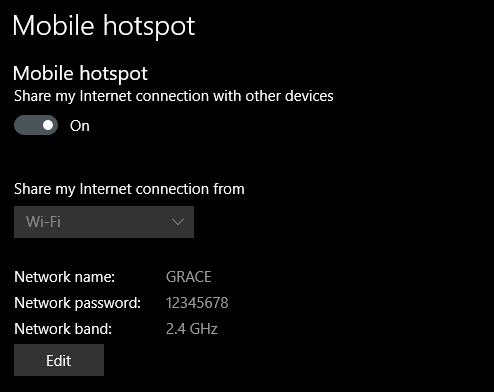
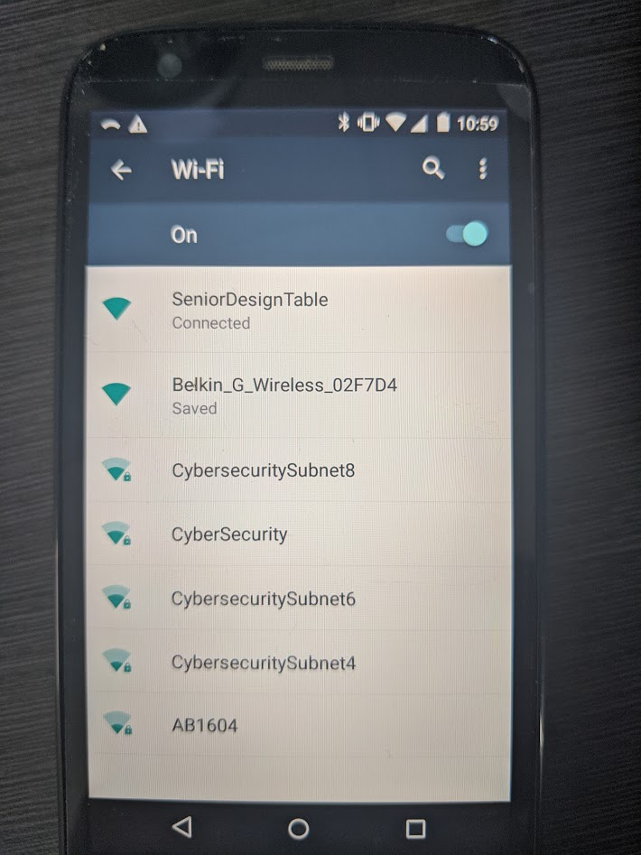
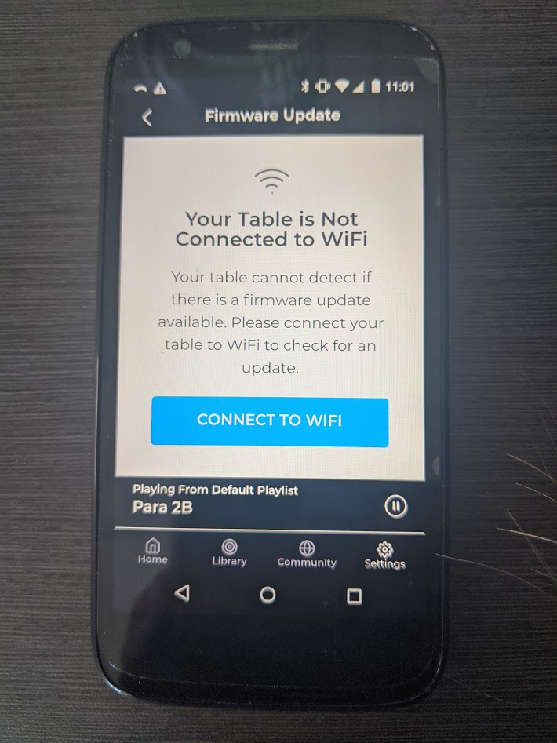
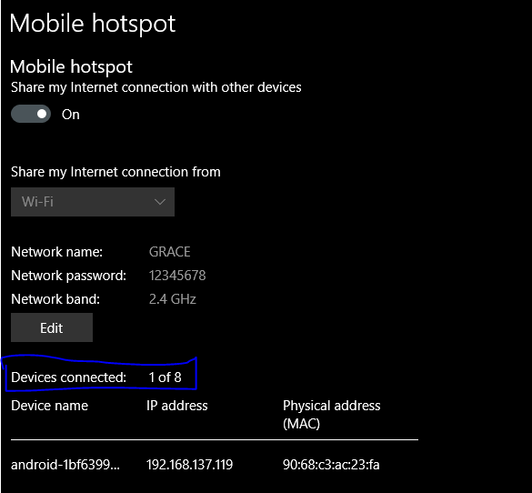
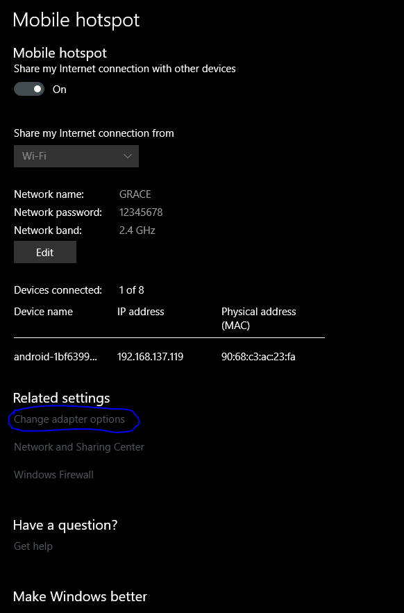
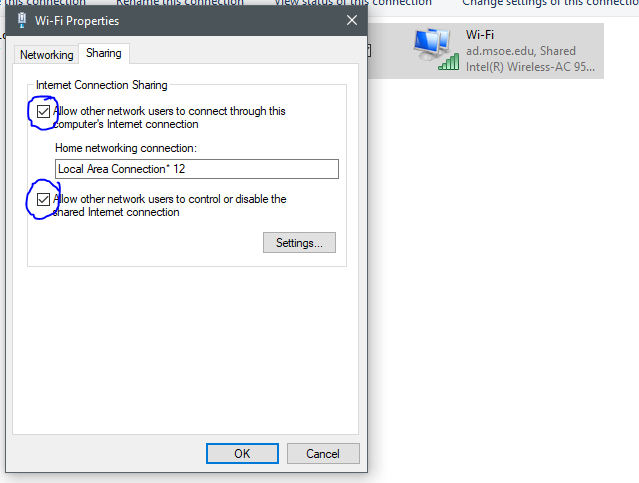

## Development Setup
The sisyphus table requires both network visibility and internet access. This is impossible to achieve by attaching the sisyphus table to the MSOE wifi network, but this can be achieved by connecting an MSOE laptop to MSOE wifi, and then using the hotspot feature on the laptop. Note that this is an interim solution until we can solidify plans with IT or Dr. Schilling to move the table to Cybersecurity lab and enable a form of remote access.

## Turn Windows 10 MSOE Laptop into a Hotspot

1) Go to Settings > Left Menu > Mobile hotspot
2) Toggle the hotspot to "On"
3) Share the internet connection from the Wi-Fi adapter.
4) Set up a more recognizable network name, not the MSOE-XYZ123 default.
5) Set a secure Network password.
6) Make sure the Network band is set to 2.4Ghz. The table does not have a 5Ghz band and will not see the network if you select anything except 2.4Ghz.

^^example setup (with simple, insecure password--please make yours more secure :) )

## Connect the Sisyphus table to the Hotspot
1) The sisyphus table will come up in AP mode when it can't find a wifi network it has on file. This is called "SeniorDesignTable."
2) Connect the team phone to the SeniorDesignTable wifi. 

3) Go to the Sisyphus app, and connect to the table. It'll look something like this:

4) Hit "Connect to Wifi"
5) Type in the credentials you created for your MSOE laptop hotspot.
6) The table will say "attempting to connect to router." In this case the "router" the table is connecting to is the router your MSOE laptop is creating :)
7) Switch the phone's wifi over to the hotspot's network.
8) Open back up the Sisyphus app and see if you can connect to the table. In some cases, I found I had to reboot the table in order for the table to fully sign onto the laptop's hotspot.

## Oh no! It's Not Working!
* if the steps above didn't work for you, double-check the device list on your hotspot.

Verify that something (your personal phone or the team phone) can connect to your MSOE Laptop.
  * if no devices can connect to your MSOE laptop's hotspot, you may need to double-check your adapter settings.

  * double check that the properties of your wifi adapter are set to the following under the "sharing" tab:

  * For sanity purposes, uncheck everything, recheck everything, then hit "OK"
  * Now try connecting an external device to your laptop's hotspot. If this works, then go ahead and try from "Connect the Sisyphus Table to the Hotspot." If this doesn't work, you most likely have a problem with your Wifi adapter. In some cases, a driver update can help. In other cases, restarting your computer might refresh this wireless interface. 

