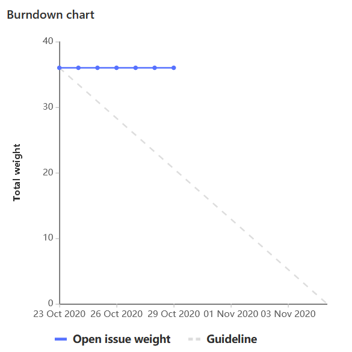

# Sprint Goal

Continue exploring different light patterns and being investigating additional inputs to affect lighting schemes.

# Burndown Chart

_As a reminder - we forgot to start the milestone on time so we adjusted the start date to give a more representative burn down chart._

# Team Commitment

## Burkhardt, Robert
###### Hours: X
###### Rating (0-10): X
###### Summary:

Insert Summary Here

## Casper, Joseph
###### Hours: X
###### Rating (0-10): X
###### Summary:

Insert Summary Here

## Enters, Stuart
###### Hours: X
###### Rating (0-10): X
###### Summary:

Insert Summary Here

## Fleming, Grace
###### Hours: X
###### Rating (0-10): X
###### Summary:

Insert Summary Here

## Wojciechowski, Andrew
###### Hours: X
###### Rating (0-10): X
###### Summary:

Insert Summary Here

# Discussion

## Key Meetings

## Findings

## Successes

## Risk Updates

# Questions

Insert Questions here

# Conclusion

Insert Conclusion here