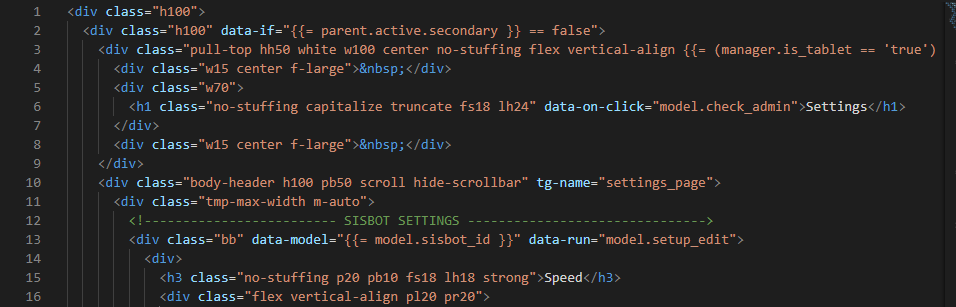

# Intro
All of this information was paraphrased from a meeting that Andy has with Matt in the beginning of the spring quarter. If anything else is discovered with Siscloud that we are not sure about send an email to Matt and update this article with new information received from Matt.

# HTML Rendering Information
The HTML templates for siscloud are stored under the tmp directory and those templates use JavaScript backbone models. Those backbone models are stored under the js/models directory. The templates use these models in a hierarchy structure. So, the current model being used is defined in the model field and all models have a parent and a grandparent field accessible through `model.parent` and `model.grandparent`. The model's grandparent is the same as accessing the field using `model.parent.parent`. All of the parents for the model can be accessed via the `model.parents` array.

# Settings the Current Model in HTML templates
All of the JavaScript backbone models have an id field on them and those ids are used for setting the current model. An example of this is if the current model has a field called sisbot_id like in app.model.sisyphus_manager.js the current model can be switched to be the sisbot model which is under app.model.sisbot.js by doing something like this in the HTML.

`
`

Everything under that div then will have the current model set to be the sisbot model and then after the end of this div the current model will go back to the previous model.

# Example
The following screenshot shows the beginning of the settings-tmp.html template

On line 1 of this file the current model is the sisyphus manager model which is defined in app.model.sisyphus_manager.js. The parent on line 1 is the session which is defined in app.model.session.js. Line 13 then makes the sisbot model defined in app.model.sisbot.js the current model. The sisyphus manager then becomes the parent on line 13 and the session becomes the grandparent.

# Debugging Tips

* To determine the current model you can do something like this to output the current model id to the screen ` 
{{= model.id }}
`
* To enable debug output to the dev tools console you can either set app.config.is_debug = 'true' via the dev tools console and refresh the page. Or you can edit the is_debug property before you start siscloud in js/app.config.js