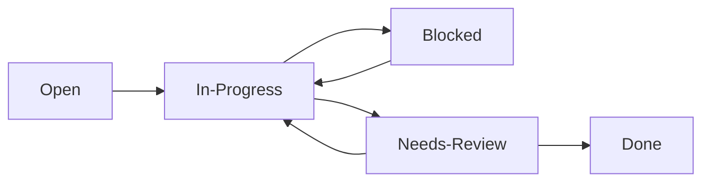

# Purpose

This document outlines the Git Flow that the team will use when contributing to the repository.

# Branching

The team will use a master/dev branching scheme. This means that the `master` branch will contain only code that would be deployed in production environment. The `dev` branch will collect the different features, defect fixes, and general improvements that will be lumped together in a "release" when merging into the `master` branch.

The team has initially decided on this approach because there aren't currently any well-defined features that the team will aim at implementing. Rather, the team will first be exploring the technologies and Sisyphus table - this makes it harder to develop in a feature branch set-up which is better suited for well directed and speedy iterative development.

## Getting Started

```bash
git checkout master
git pull
git checkout dev
git pull
git checkout -b <branch-name>
```

Add changes and commit like so:

```bash
git add <files>
git commit -m <commit-message>
git push -u origin <branch-name>
```

**Commits should be atomic - that is at any point checking out a commit should not prevent the project from running**

When changes are stable and well tested then a developer may open a Merge Request (MR) to add their changes to the `dev` branch.

## Merge Requests (MRs)

Merge requests ensure proper review is performed on code before it is added to the shared repository.

At a minimum - an MR should have **2** reviewers in addition to the submitter (for a total of 3 reviewers). This ensures that more than 50% of the team has validated the code.

When possible - MRs should "Squash Commits". *This is not required.* Squashing commits is helpful in-case a merged must be reverted (only a single commit to undo). It also keeps the `git` history clean in that it's more understandable what a commit means in terms of the repo. state.

## Releasing to `master`

Once a set of well tested and reviewed changes are collected on the `dev` branch - the team will schedule a meeting with Dr. Taylor, the Product Owner, and the Lead Developer to review what was done. Upon approval the team will open an MR from `dev` to `master` and merge the changes in.

# PBIs

PBIs *must* include:
* A user story
* Tasks
* Details and dependencies

A PBI template is included with the project to reduce the overhead for ensuring all these elements are present on a PBI.

## Story Pointing

TBD

## PBI Flow

A PBI's status will follow this path as work is completed. This is done so the team as insight into the current state of work and can adopt different scrum practices (swarming) to ensure as much work gets completed during a sprint

