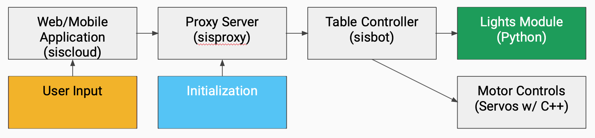

# Team Components

# Requirements

Currently the team does not have a defined project that drives new requirements (i.e. a new piece of software to augment the table). In lieu of writing requirements for a non-existent feature the team has detailed requirements that describe the table’s current functionality. _More requirements will be created once the team has a well-defined project goal._

## Requirement Shells (a.k.a. Snow Cards)

### Functional Requirements

F1: All light patterns shall be swappable on the table by a user

*   Description: In order to set light patterns on the table they should be available to import via a socket so that the lights module knows what the current light pattern on the table is.
*   Rationale: The lights module is written in Python unlike the main server for the application which is written in JavaScript. So, a way is needed in order to import light data from the JavaScript server into the Python lights module.
*   Originator: Andrew Wojciechowski
*   Fit Criterion: When a new pattern is developed, it shall not be considered “finished” until it has been tested by importing the pattern into the lights module over a socket connection from the JavaScript module to the Python module
*   Customer Satisfaction: 8
*   Customer Dissatisfaction: 10
*   Priority: High
*   Dependencies: None
*   History: Last modified 10/7/2020

F2: The brightness shall be adjustable on all new LED light patterns.

*   Description: When the LEDs are turned on for a table a user shall be able to make those lights either brighter or dimmer.
*   Rationale: Changing the brightness can change the effect of how the currently running track looks so a user will want to be able to change the brightness to change the effect it has on the currently running track.
*   Originator: Andrew Wojciechowski
*   Fit Criterion: When a new pattern is developed is shall not be considered “finished” until changing the brightness has been tested with the new pattern
*   Customer Satisfaction: 5
*   Customer Dissatisfaction: 5
*   Priority: Medium
*   Dependencies: None
*   History: Last modified 10/7/2020

F3: Light patterns shall be set via the Sisyphus mobile app

*   Description: When we develop new light pattern a user shall be able to select a light pattern via the Sisyphus mobile app
*   Rationale: The Sisyphus mobile app provides an easy interface for users to control the LED lights on the table
*   Originator: Andrew Wojciechowski
*   Fit Criterion: When a new pattern is developed, it shall not be considered “finished” until it has been tested by selecting it via the Sisyphus mobile app
*   Customer Satisfaction: 8
*   Customer Dissatisfaction: 8
*   Priority: High
*   Dependencies: None
*   History: Last modified 10/7/2020

F4. All light patterns produced shall be defined and useful for tables of an arbitrary size.

*   Description: Light patterns should function on a user’s table regardless of the table size that they have purchased.
*   Rationale: Some patterns lend themselves more easily to certain tables due to the number of lights. While this might suit some patterns, a customer with an _n-_led table should be able to run any pattern from the sisyphus lighting pattern library.
*   Originator: Grace Fleming
*   Fit** **Criterion: When a new pattern is developed, it shall not be considered “finished” until it has been tested using an arbitrary number of pixels.
*   Customer** **Satisfaction: 5
*   Customer** **Dissatisfaction: 10
*   Priority: High
*   Dependencies: None
*   History: Last Modified 10/06/2020

### Nonfunctional Requirements

N1. Any external sensors added to the system in the course of the project shall use officially-supported drivers.

*   Description: If a sensor is added to the table, and a driver is required to read/write from the sensor, then the driver used shall be officially supported by the sensor manufacturer or another established institution.
*   Rationale: Drivers notoriously have compatibility issues. This often leads developers to choose drivers from open-source that are not officially supported. While these drivers might “get the job done” at first, they quickly fall out of support and cause headaches down the road for development. To prevent this, we recommend that all drivers used for any additional sensors in the project be driven by officially-supported drivers.
*   Originator: Grace Fleming
*   Fit Criterion: When a sensor is added to the table, the driver (if applicable) must be published by a certified manufacturer.
*   Customer Satisfaction: 0
*   Customer Dissatisfaction: 0
*   Priority: Medium
*   Dependencies: None
*   History: Last Modified 10/06/2020

N2. Any new patterns developed for lighting shall support a colorblind mode.

*   Description: Every pattern shall have a color palette that it can use in the event a user is colorblind.
*   Rationale: Light patterns should be enjoyed by all users who purchase a table, even those whose perception of color is not the same as the majority of the human race.
*   Originator: Grace Fleming
*   Fit Criterion: When a new pattern is developed, it shall not be considered “finished” until it has a color palette that it can use for a colorblind user.
*   Customer Satisfaction: 3
*   Customer Dissatisfaction: 2
*   Priority: Low
*   Dependencies: None
*   History: Last Modified 10/06/2020

N3. Any new light patterns developed shall provide clear, concise and helpful diagnostic information to the log files.

*   Description: Light patterns may error out in the course of running. If this is the case, they should log to an appropriate logging location with the necessary information to make troubleshooting remotely timely and easy. This will result in a faster problem resolution for customers.
*   Rationale: The developers who have developed all previous lighting patterns likely know what to look for when the lights encounter issues. In the case of added light patterns that we develop, having the relevant diagnostic information on hand could be very important to diagnosing issues with the table.
*   Originator: Grace Fleming
*   Fit Criterion: When a light pattern encounters an error, it shall log to the log file and record the time of the error, the error code, a description of the code, and a stack trace if applicable.
*   Customer Satisfaction: 2
*   Customer Dissatisfaction: 5
*   Priority: Low
*   Dependencies: None
*   History: Last Modified 10/08/2020

# Software Architecture and Modeling

It should involve some interesting elements of software system design, including thoughtful exploration of the architecture to support iterations.

The Sisyphus table consists of 3 distinct parts - the motor control, the lights control, and the server that orchestrates all operations and communicates with the client app which provides user controls. These parts map to real world elements of the table and serve as a consistent separation of concerns. For the beginning of our project we were tasked with exploring the lighting system and generating new and interesting interactions. This requires knowledge of how the system and it’s APIs work but also requires understanding of how commands are sent from the server and processed by the lighting module. While the team is not drafting an architecture from scratch any changes made must be rectified against the current architecture or must investigate and address shortcomings.

For example, to control the lights a command is sent from the client app to the table’s server which will then gather data from the appropriate locations (data stores for color preference, current ball position queried from motor control), package it, and send it over a local file server connection to the lighting module. Planned work for incorporating APIs to determine lighting behavior must understand, and extend this client-server architecture in order to produce new functionality.

Additionally, the team is investigating producing a “releasable” upgrade which will introduce new functionality to the system. For example, the team may choose to incorporate motion controls that move the ball and adjust the lights based on user actions. New additions like this would require their own architecture of sub-modules (how is data passed around, how are interfaces exposed, etc.) and integration into the larger table’s architecture.

# Design

The system currently does not use any patterns and this has resulted in monolithic files and copy-pasted files with duplicated behavior and code. This means the codebase is ripe for patterns and refactors to introduce modern software strategies that would make the code more maintainable, and understandable.

One such example is the lighting module. Each lighting pattern has its own file with two functions (an init and update). The init behavior is nearly identical across files while the update contains the business logic for executing the different lighting patterns. This module can be refactored to use a strategy pattern (context uses common interface, multiple implementations).

In keeping with agile principles, the team does not plan on working on refactors outright but will rather incorporate re-writes and patterning as code is modified with other work. With new functionality, patterns and other design strategies will be considered in how to best implement the work.

# Testing

For testing the table in our PBIs we go through testing our changes on the table manually as well as writing automated tests for our PBIs. We considered this from the beginning and we set up a separate Git repository for writing our unit tests and we set up automating testing infrastructure for the Python lights module using PyTest and for the JavaScript module using the mocha and chai frameworks.

# Security and Privacy

We haven’t had to worry about security and privacy yet since it’s early in the project and we’re working on getting other things set up first. But in the future we’ll have to make sure that the Raspberry PI  is secure making it difficult for bad actors to access the PI.Also, on the PI we’ll have to worry about making sure that any secret data on the Raspberry PI is stored securely on the PI using methods like encryption. Also, for the web components of our application we’ll want to make sure that the web endpoints on the table aren’t accessible by unwanted actors.

# Tools

## Gitlab 

*   Issue Tracking - we utilized the Gitlab native issue tracker to assign tasks to specific people, track the time we were spending on each issue, and commenting on knowledge acquisitions to create a detailed log for anyone else who viewed the issue
*   Milestones - as a scrum team we leveraged the Gitlab milestones to act as sprints, assigning issues to be completed, tracking our burndown, and grooming the backlog to ensure the maximum priority tasks are always getting completed
*   Wiki - we utilized the builtin wiki in Gitlab to keep track of our external documentation: from ceremonies to brainstorming to meeting logs
*   CI - we created a project to run our test set against all the existing projects on a push

## Hardware

*   Our hardware for this project is somewhat set. However, we have had to overcome a number of problems in order to develop locally. For developing code controlling the lights, we each had to purchase the relevant hardware, and then adapt the code so it would work locally. We also needed to interface with the existing hardware, so we set up a live-stream on twitch.tv and got ssh capabilities exposed on a VPN.
*   Pytest and Mocha - we integrated PyTest and Mocha in order to test the codebase.
*   Pylint & ESLint - in order to improve the quality of the code, the team introduced linters to the projects. These will hopefully ensure that the code we are adding to the project is clear, readable, and maintainable

# Experimentation and Prototyping

While this project is fairly limited where new technology is concerned, we are interested in improving some out of date software packages included in the existing application. To do this, we are creating prototypes of the existing code with the newer packages to gauge the difficulty of upgrading the codebase.

## Spikes

Since the project is not “greenfield”, these spikes aren’t attempting to explore different architecture and technology decisions for meeting project requirements but rather to explore the use of new technologies. Thus there is little risk in performing these spikes and implementing their results. The greatest risk that accompanies these spikes is lost time in dead-end features.

1. Augmenting table to use audio input to drive light patterns
*   New Technologies:
    *   Speakers
    *   Audio signals
    *   Media Player APIs (e.g. Spotify)
2. Using machine learning techniques to translate photos to artistic and abstract ball tracks
*   New Technologies:
    *   Photos (within Sisyphus client application)
    *   Machine Learning Algorithms (e.g. Neural Networks)
    *   Cloud Computing
3. Augmenting table with additional input from SONAR/LIDAR sensors to manually control ball movements with hands
*   New Technologies:
    *   SONAR/LIDAR sensor
    *   C/C++/driver to receive/transmit sensor data
    *   Bluetooth/USB
4. Sync smart watch heart-rate sensor with table lights
*   New Technologies:
    *   Smartwatch brand & associated OS (e.g. Garmin, Fitbit, Apple watch, etc.)
    *   Bluetooth
5. Sync phone notifications with table lights
*   New Technologies:
    *   Bluetooth
    *   Android Native
    *   iOS Native

# Third Party Components

This project involves the integration of many third-party components. The tech stack relies exclusively on a Raspberry Pi 3 model A architecture, integrates Adafruit Neopixel lights with a third-party custom python library, uses Apache Cordova for running the mobile app, and runs a web server through node.

To this tech stack, our team has added linters for Python (pylint) and Javascript (ESlint) to prevent compilation mistakes and other stylistic errors since we are unable to run the actual code in a pipeline due to not having a docker container with a raspberry pi’s architecture. Linters, however, can be run in an architecture agnostic fashion and can prevent major issues from entering into the codebase. We also added unit testing frameworks (see “Tools” section).

We are also considering updating some of the third-party components of the system (such as the python library) to bring the codebase up to date.

The team is also making use of a variety of third-party components to perform development and debugging, such as the VSCode SFTP plugin (to develop on a different device’s file system), MobaXTerm/Putty (SSH clients), CURL (making web requests in an SSH session) and Win32Imager (to create and write backup copies of SD cards). For more information on third-party components integrated by the team into the project, see the “Tools” section.

# Documentation

The team currently manages a wiki that exists alongside the fork of the codebase. This structured wiki include weekly status reports submitted to our advisor, sprint plans that document promised work, and sprint reports and retrospectives that analyze completed work and the team’s process in order to reduce development risk and ensure incremental and sustainable progress is made during the course of the project.

All ABET-type requirements (such as technology reports, and outcomes) are documented in the wiki as well in order to maintain a single source of truth for artifacts relating to the project.

# Managing Risks

There are many risks associated with our project, both in terms of development continuation and completion. Risks whose threat to the project is highest and most likely are listed below:

## Product Owner

The Product Owner will lose interest in the project or be otherwise indisposed to provide useful feedback.

*   Managing Risk**:** Even without proper feedback from the Product Owner, our team can continue to innovate new ways to interact with the table. In addition to our primary Product Owner, the team and team’s advisor can together serve as a proxy product owner team to decide what areas of investigation and development are worth pursuing.

## Legacy Code

Development on the product will become difficult or impossible due to the deprecated nature of Python 2.7, the outdated rpi_ws281x lighting library, the use of Node 8, and the fading support of the Cordova cross-platform web and mobile framework.

*   Managing Risk**:** Look into upgrading libraries that can be upgraded. In particular, perform incremental upgrades as code areas are worked on and investigated.

## Development Environments

Local development environments do not mirror the production environment precisely, since developers don’t have their own tables. Developers are developing locally with different Raspberry Pi versions and their own versions of Neopixel strips that are not identical to the strips used on a production table.

*   Managing Risk**:** Developers can interface consistently about issues with their setups to ensure that when a developer faces an issue with their setup the issue is not replicated across setups. Once a person has their development environment completed, they can distribute an image from their SD card for a certain platform (e.g., the Raspberry Pi 4). This should help with consistency across setups. For those using Raspberry Pi 3’s, a production image from a production raspberry pi can be used. 

There is only one production environment. This production environment is located in a common lab that all developers have access to at MSOE (DH329); however, this lab has the potential of not remaining open if the institution must revert to complete-online instruction due to the pandemic.

*   Managing Risk**:** A webcam has been placed on the production environment to enable remote development. SInce the team is able to exert some level of control over the production environment locally, in-person access does not need to be frequent. In the case of a total closure of the labs (no personnel permitted inside the building), the table can be migrated to a team member’s house, or accommodations with MSOE to allow 1 team member into the building at an agreed upon interval of time can be arranged.

Both local and production environments have proved to be quite brittle. Local setups behave strangely on occasion (interacting oddly due to apartment wiring issues) and the production environment has had issues with the LED lights shorting out.

*   Managing Risk**:** The production table as well as the miniature table owned by Dr. Taylor had their lights replaced by Sisyphus Industries after the lights burned out. Our team has resolved to be more careful about plugging/unplugging the table to prevent future burnouts.

# Standards Used

*   PEP 8 - code standard for Python code. Implemented with pylint.
*   ES6 JS - code standard for Ecmascript code and Ecmascript features. Ensured with eslint.
*   ISO 8601 - Date and time standard. Used whenever dates are present.
*   GitLab CI - Pipeline manager. Runs with each commit. 