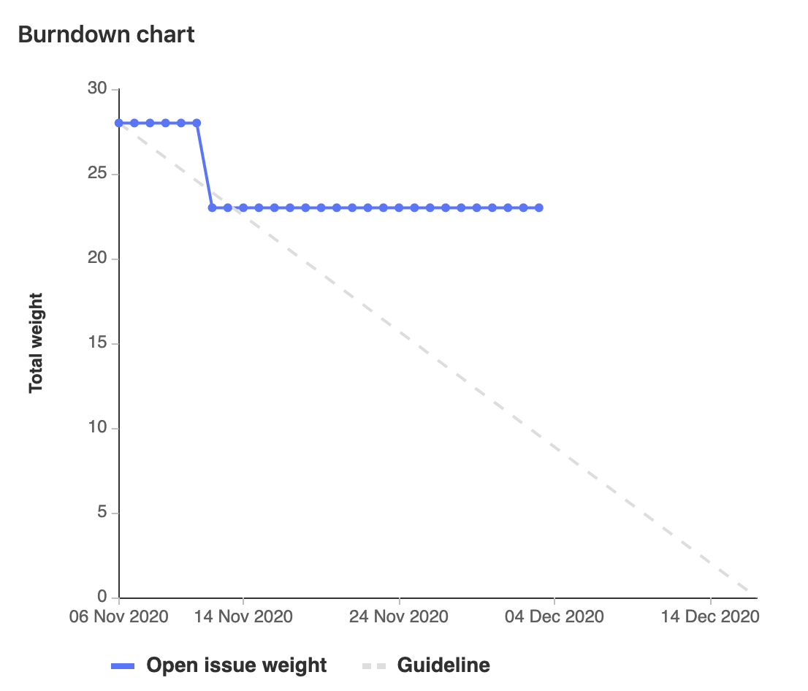

# Sprint Goal

Finish off carryover from sprint 2, and explore methods of input for lighting dependent on physical environment.

# Burndown Chart

# Team Commitment

## Burkhardt, Robert
###### Hours: ~1h (Thursday meeting with team)
###### Rating (0-10): -2 (at least I'm doing better than our initial pylint score!)
###### Summary:

I have not made any notable progress on any assigned PBIs. I might argue that I spent this week adjusting to the new quarter and I spent the break decompressing from last quarter but these are just excuses and do not justify my behavior. This is completely unprofessional and inconsiderate to my teammates. I promise to both Dr. Taylor and my team to make up this weeks work and more in the coming days so that I am making contributions to the team and helping complete this sprints work.

## Casper, Joseph
###### Hours: X
###### Rating (0-10): X
###### Summary:

Insert Summary Here

## Enters, Stuart
###### Hours: X
###### Rating (0-10): X
###### Summary:

Insert Summary Here

## Fleming, Grace
###### Hours: X
###### Rating (0-10): X
###### Summary:

Insert Summary Here

## Wojciechowski, Andrew
###### Hours: X
###### Rating (0-10): X
###### Summary:

Insert Summary Here

# Discussion

* Since the table seems to have continuous issues - the team created a PBI to track time spent debugging the table that will exist across sprints (similar to how the Ceremonies PBI exists).

## Key Meetings

* Andy and Grace met Tuesday (2020-12-01) to debug the lights in lab (George briefly joined via Teams to give his 2 cents).

## Findings

* GPIO can be used for audio input!!
* Productivity really suffers during term breaks and week 1 of new terms.

## Successes

* Grace was able to use Dr. Taylor's table setup to test the large table's light strip and isolate the issues to the table hardware and not the lights (which still work).

## Risk Updates

* The table lights aren't working again (uh oh) - but the motors still run and the server is still accessible so it's more likely a hardware issue (probably the Pi Hat or wiring between the Pi and the strip).

# Questions

* How does Dr. Taylor feel about re-locating the mini table to the lab?
* How should we proceed with fixing the table? We promise we aren't incompetent!
    * Should we reach out to Bruce and Matt?
* Can you grant us access to a Pi 3 Model A from EECS to both help debug the table and to switch out Grace's Pi (which is currently running the stream)?

# Conclusion

The team is disheartened by the electronic issues and doesn't feel great about our "contributions" for the first couple weeks. However, we are rearing to tackle the remaining work in the coming weeks and hunt down all the electronics gremlins (see below).

(We might get in contact with some of our EE/CE peers to see if they have any insights)

